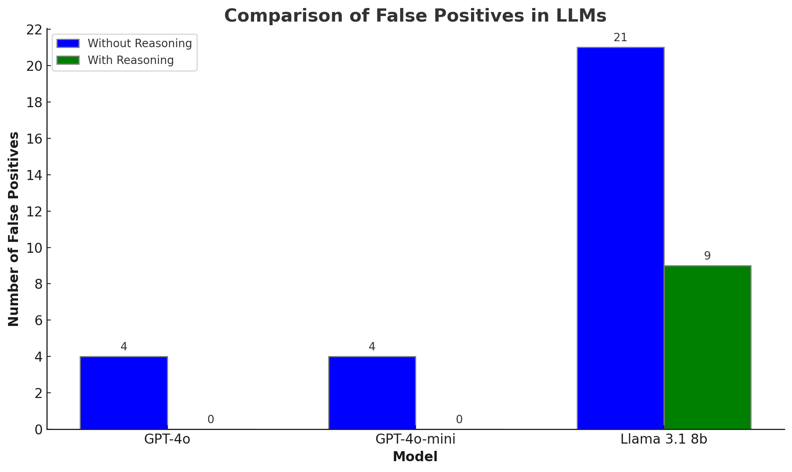

Here's a README for your GitHub project:

# LLM Powered Reddit Posts Filter

## 🚀 About

LLM-Powered-Reddit-Posts-Filter is an tool that I developed that uses Large Language Models (LLMs) to automatically identify and filter laptop sale posts from Reddit's r/hardwareswap subreddit. This project demonstrates the practical application of LLMs in enhancing search capabilities and user experience in online marketplaces. this can be easily modified to suit your needs.

## 🌟 Features

- Automated scanning of recent posts on r/hardwareswap
- LLM-powered identification of laptop sales, even when not explicitly mentioned
- Web interface for easy viewing of filtered results
- Data persistence using SQLite

## 🛠️ Tech Stack

- Python
- Meta's Llama 3.1 8b (via Ollama)
- OpenAI API Spec
- Reddit API
- FastAPI
- SQLite

## 📊 Performance

Adding a reasoning step to the LLM's decision-making process significantly improved accuracy. For GPT models, this step led to 100% accuracy, and for LLaMA, it reduced false positives from 21 to 9. check the images below for more detailed metrics:



## 📋 Prerequisites

- Python 3.8+
- Ollama (for running Llama 3.1 8b locally)
- Reddit API credentials
- OpenAI API credentials (if using openai)

## 🔧 Installation

1. Clone the repository:
   ```
   git clone https://github.com/SomaRe/LLM-Powered-Reddit-Posts-Filter.git
   ```

2. Install required packages:
   ```
   pip install -r requirements.txt
   ```

3. Set up your Reddit API credentials in a `.env` file:
   ```
   CLIENT_ID=your_client_id
   CLIENT_SECRET=your_client_secret
   USER_AGENT=your_user_agent
   LLM_API_KEY=your_llama_api_key
   LLM_BASE_URL=your_llama_base_url
   LLM_MODEL=your_llama_model
   ```

4. Ensure Ollama is installed and Llama 3.1 8b (or other language model) is available. (if using locally)

## 🚀 Usage

1. Start the FastAPI server:
   ```
   python app.py
   ```

2. Open your browser and navigate to `http://localhost:8000` to access the web interface.

## 🤝 Contributing

Contributions, issues, and feature requests are welcome! Feel free to check [issues page](https://github.com/yourusername/LLM-Powered-Reddit-Posts-Filter/issues).

## 📝 License

This project is [MIT](https://choosealicense.com/licenses/mit/) licensed.

## 🙏 Acknowledgements

- Reddit API
- Meta's Llama model
- FastAPI community

---

Made with ❤️ and 🦙 by [SomaRe](https://github.com/SomaRe)